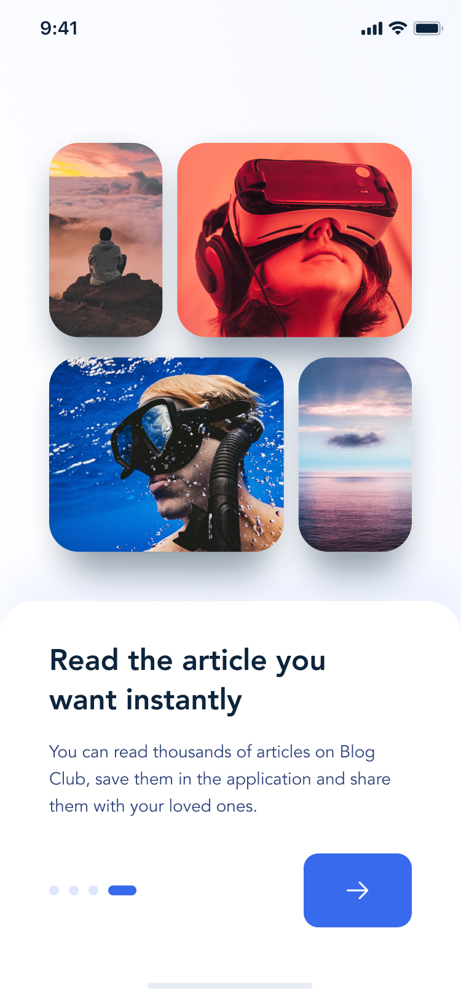
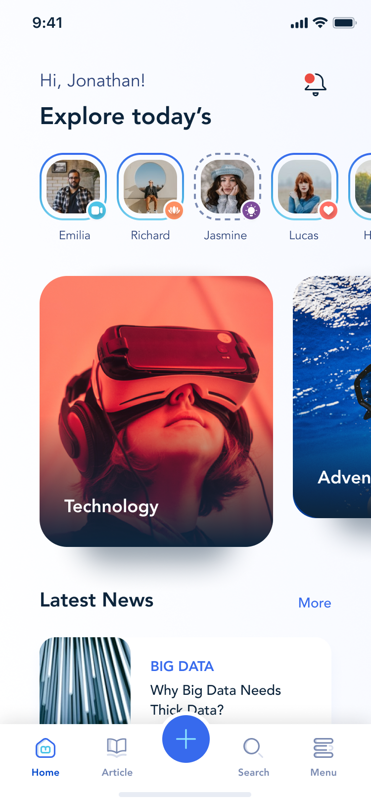
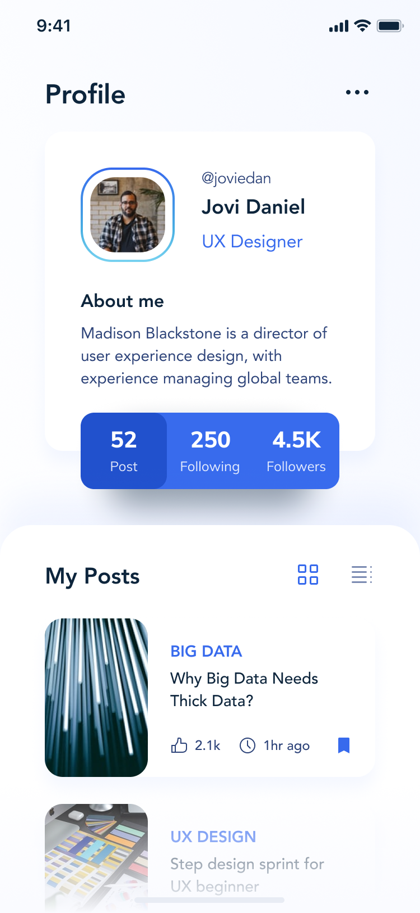
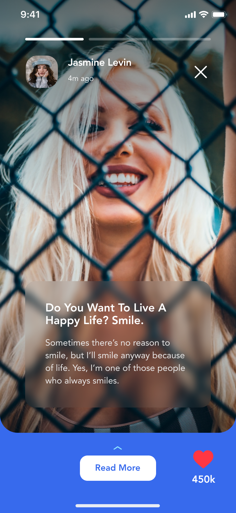
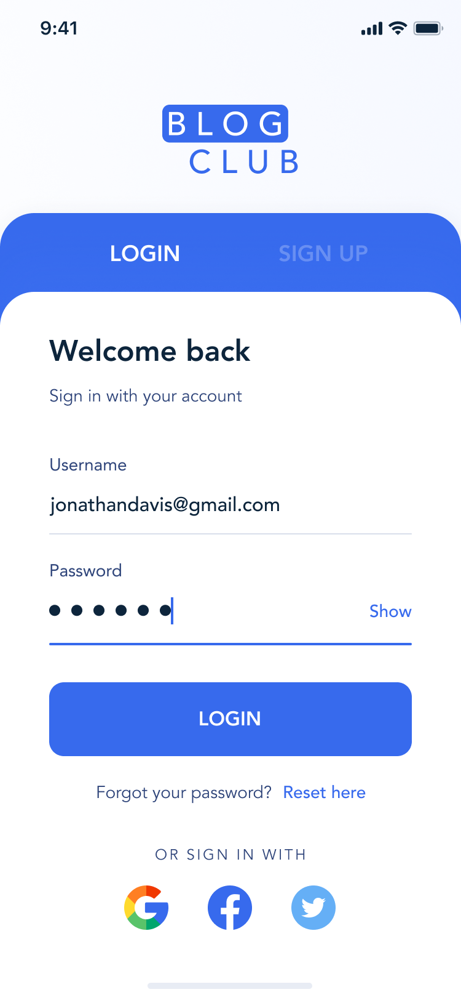

# blog_club

A new Flutter project.

## Getting Started

This project is a starting point for a Flutter application.

A few resources to get you started if this is your first Flutter project:
<table>
  <tr>

  </tr>
</table>